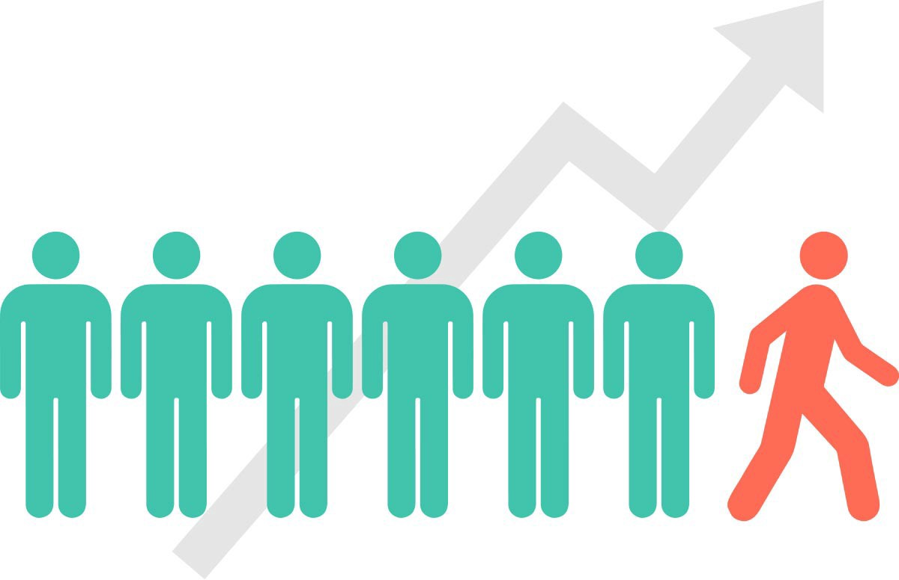

# PORTFOLIO
Hello, I'm Laurensia! Welcome to my portfolio!

I am currently on my third year of Computer Science Major🔭, Specialize in ✨Intelligence System/ Artificial Intelligence✨.I am currently focused in learning Machine Learning and Data Science. I mainly used Python, and some R. My current interest is Machine Learning Model Deployment. And so, I am currently learning Web Development (Flask).

 

Portfolio contain compilation of personal project, mainly Data Science and Machine Learning projects, updated on regular basis.

#

## PROJECTS

#

 **[Anime Recommender System: Content-based and Collaborative Filtering](https://github.com/laurensiavee/anime-recommender)** 
**Information Retrieval | TF-IDF | KNN | Cosine Similarity | Python**  
In this project I built recommender system with content-based filtering and collaborative filtering. I've also done EDA and explore most/top Animes based on rank, favorites, rated, popularity, etc (demographic filtering).

#

 **[Customer Churn Prediction and Analysis](https://github.com/laurensiavee/customer-churn-prediction)** 
**Machine Learning | Classification | EDA | Prediction | Python**  
In this project, I analyse the data and find churn correlation with feature listed. Then, I compared several Machine Learning Classification Algorithm such as Random Forest, Decision Tree, XGBoost, etc. Model shown up to 88% Churn Prediction accuracy.

#

 **[Fraud Detection on Job Posting](https://github.com/laurensiavee/customer-churn-prediction)** 
**Natural Language Processing | Machine Learning | Classification | EDA | Python**  
In this project, I build Fraud Detection with Machine Learning Classification Model. The Challenge on building Fraud detection is the highly skewed dataset(here fraudulent was only 4,8%). There's also overfit problem, and i've both solve the issue. Model shown up to 86% accuracy.

#

## MINOR PROJECTS

#

**[Orange vs Grape](https://github.com/laurensiavee/orange-vs-grape)** 
**Machine Learning | Classification | EDA | Prediction | Python**  
fun and simple Machine Learning exercise to build classifier model for citrus data (orange vs grape). Used 5 different machine learning algorithm with accuracy between 91.9% - 98.5%

#

**[Simple Calculator](https://github.com/laurensiavee/simple-calculator)** 
**HTML | CSS | JavaScript**  
simple  calculator as exercise on HTML, CSS, and JavaScript.
#

## SKILLS AND COMPETENCES
- Programming Languages:
    > Python (Scikit-learn, Tensorflow, Keras, Scipy, Pandas, Numpy, Matplotlib, Seaborn)

    > R (Ggplot2)

    > Java, C++, C, C#, SQL

- Methodologies:
    > Machine Learning, Deep Learning, Natural Language Processing, 

- Tools:
    > Git, MySQL, Jupyter

- Web Development:
    > HTML, CSS, JavaScript

#